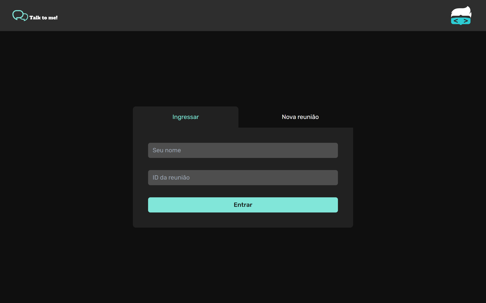
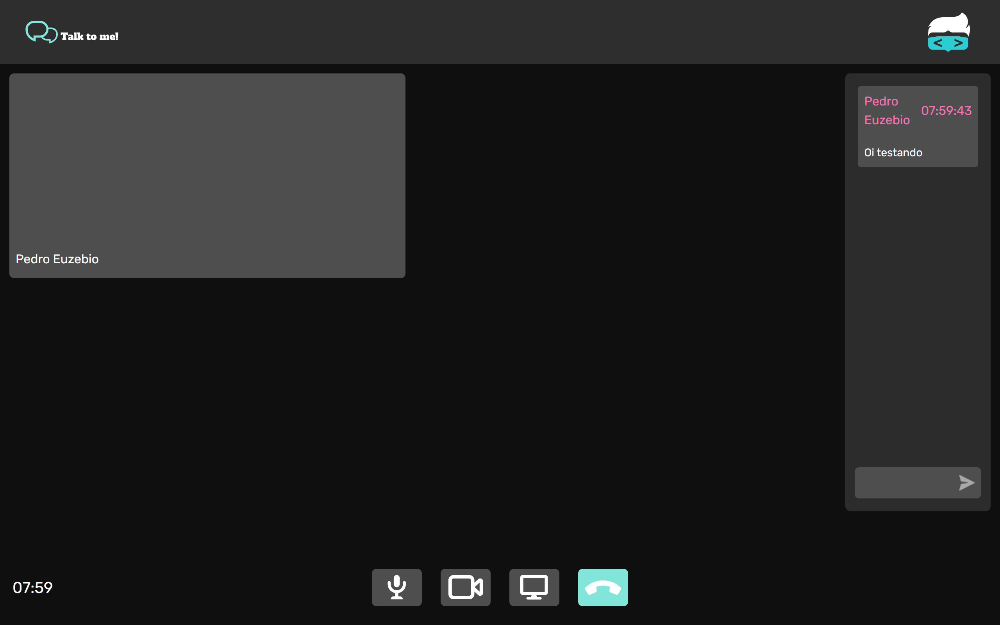

<h1 align="center">Talk to Me</h1>

  <a href="#tecnologias">Tecnologias</a>&nbsp;&nbsp;&nbsp;|&nbsp;&nbsp;&nbsp;
  <a href="#projeto">Projeto</a>&nbsp;&nbsp;&nbsp;|&nbsp;&nbsp;&nbsp;
  <a href="#licenca">Licença</a>

  

      
  

## 🛠 Tecnologias

Esse projeto foi desenvolvido com as seguintes tecnologias:

- React
- Next.js
- Tailwind CSS
- Node.js
- Socket.io

## 💻 Projeto

O Talk to Me é um clone do Google Meet onde é possível entrar em uma sala, criar uma nova sala, digitar no chat e ligar a câmera

## 📝 Licença

Esse projeto está sob licença MIT. Veja o arquivo [LICENÇA](LICENSE.md) para mais detalhes.

---

Feito com ♥ by Pedro Euzebio
